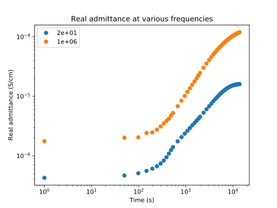
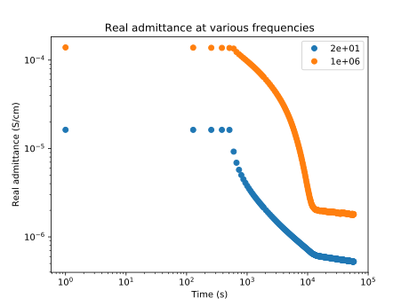

# Animating Transient Data

Visualizing data using animations can help to elucidate trends in data that
evolves over time. The animation below demonstrates the evolution of the
imaginary part of the electrical modulus in an iron-doped strontium titanate
crystal at 210°C during and after the application of an 80 V/cm electric
field.

The way that these peaks shift and split as the degradation and recovery
progresses reveals how the conductivity of the material changes with time in
different regions. This conductivity evolution was not possible to
characterize using the previous method of displaying conductivity vs. time
during degradation:

and during recovery:

Everything needed to reproduce these animations, including the source data,
can be found in this repository.